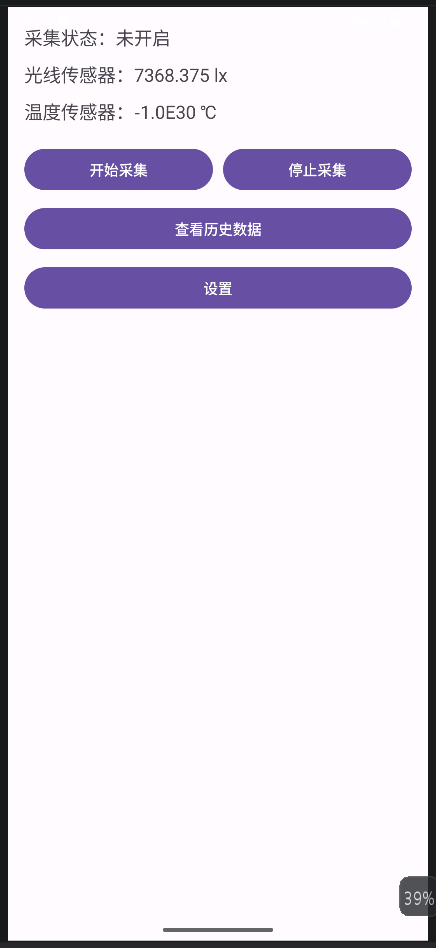
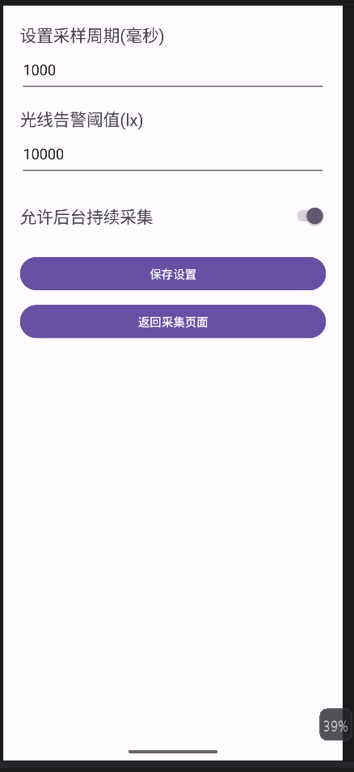
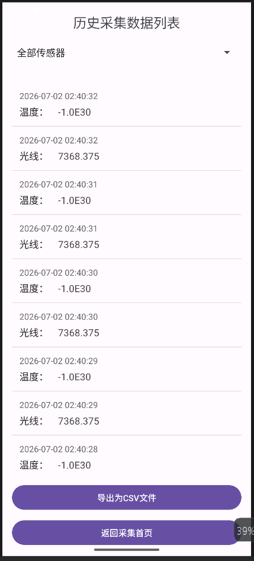

# 传感器数据采集 App
## 一、项目简介
本项目是一款Android本地传感器采集工具，后台服务持续采集光线、温度数据，使用SQLite数据库持久保存全部采集记录；
提供参数配置、历史数据列表、数据导出CSV、实时数值展示功能，适配Android 8.0及以上设备。

## 二、开发环境
- Android Studio：Iguana | 2023.2.1
- Gradle Plugin：7.4
- Gradle 版本：7.5
- Compile SDK Version：34
- Minimum SDK：26
- Target SDK：34

## 三、功能清单
- ✅ 首页：启动/停止采集、实时显示光线、温度数值
- ✅ 设置页面：后台采集总开关、自定义采样周期、光线告警阈值
- ✅ SQLite本地数据库存储所有历史采集数据
- ✅ 历史数据页面：按「全部/光线/温度」筛选数据列表
- ✅ 一键导出历史数据为CSV文件，保存至系统Download文件夹
- ✅ 导出完成推送系统通知，点击通知可直接打开CSV文件
-    传感器数据趋势折线图表展示
- ✅ 前台服务常驻通知，提升后台采集保活优先级

## 四、运行截图

## 五、APK 下载地址
https://github.com/junma661/Android-SensorApp

### 2. 仓库内置安装包
/app/release/app-release.apk

## 六、编译运行步骤
1. 克隆本项目到本地，使用 Android Studio 打开根目录
2. 等待 Gradle 自动同步所有依赖
3. 连接安卓真机/模拟器，授予「通知、存储」权限
4. 点击顶部 Run 按钮，编译并安装 App
5. 进入首页点击「开始采集」即可正常使用全部功能

## 七、项目目录结构
